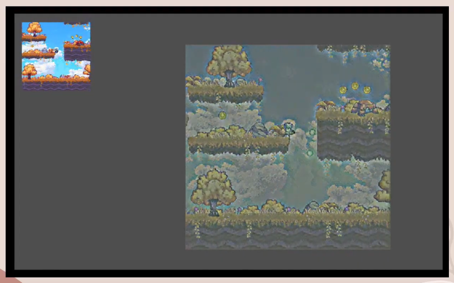

# Godot-Style-Transfer
This repo compiles to a custom Godot plugin to run Style Transfer in Engine on viewport textures

The plugin code can be found in "ArtSyn_extension" folder

A demo for using the plugin in Godot can be found in "2d-platformer-demo"

The code for training the style transfer model can be found in "Real-Time-Style-Transfer"

The model is based off this repo: https://github.com/1627180283/real-time-Style-Transfer

This readme will be updated for setup and compiling soon!!! This code is currently uploaded only for reference

